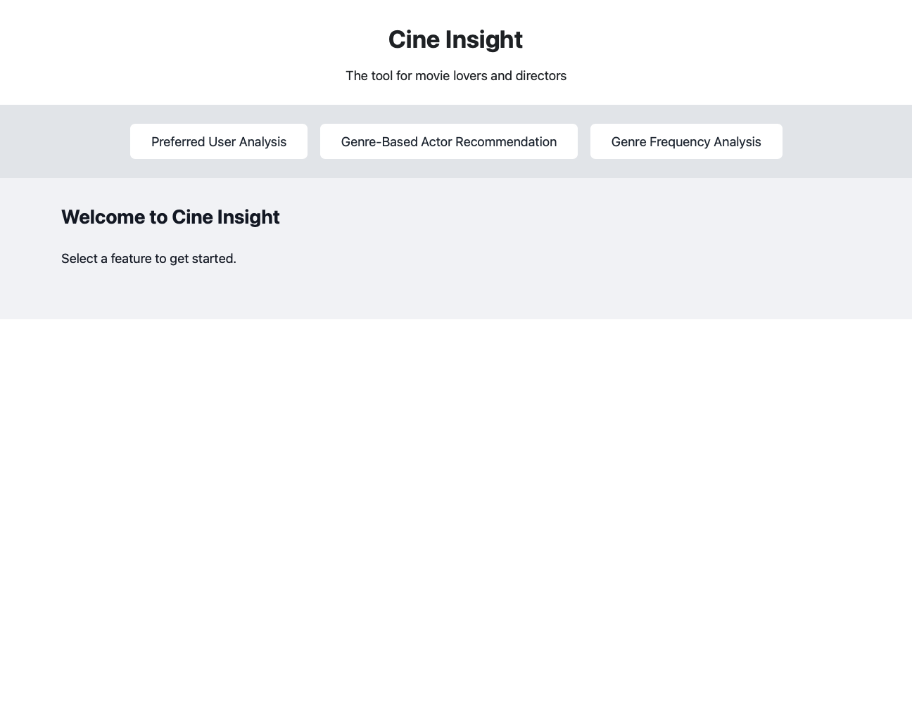
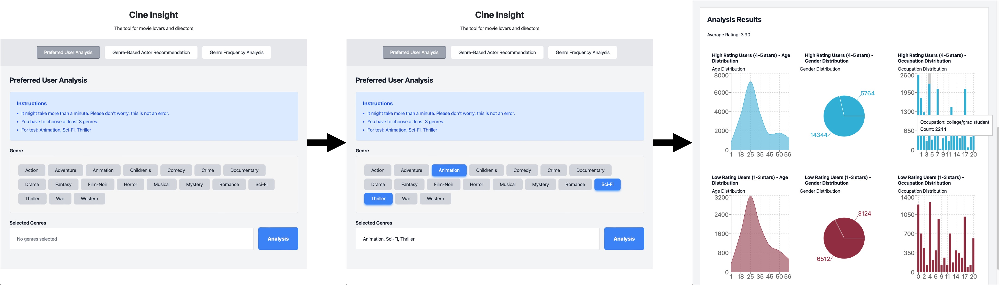
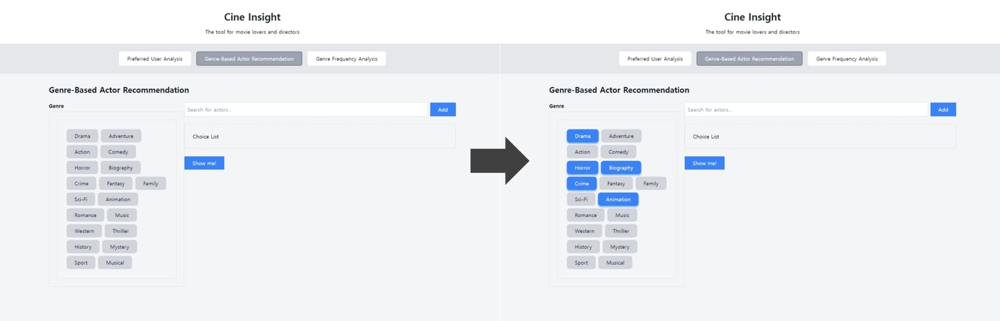
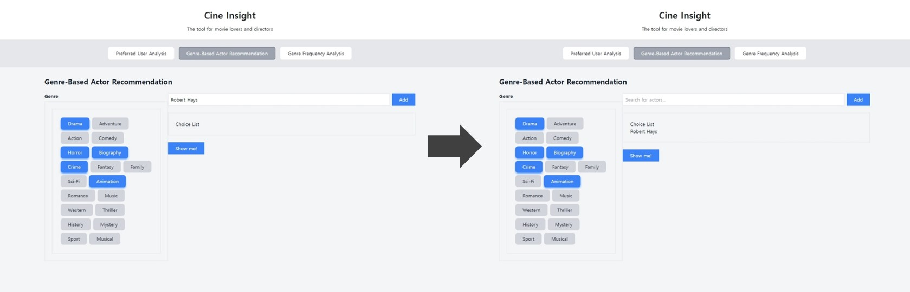
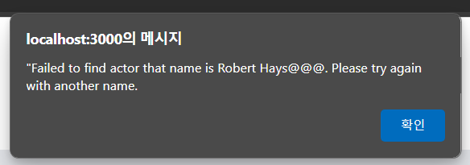
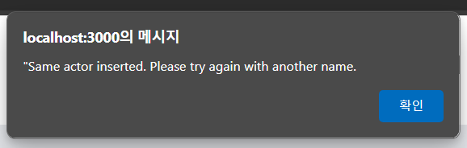
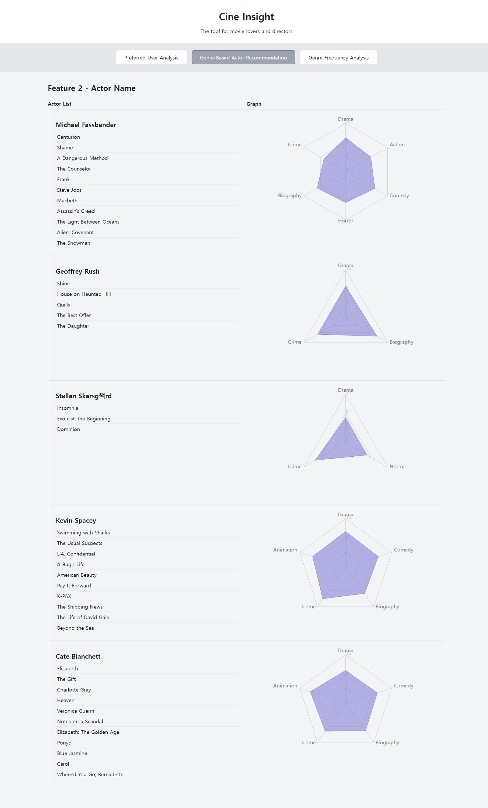

# 🎬 Cine Insight

## Introduction

Francis Ford Coppola said one day...

> _Art depends on luck and talent._

But seriously, when we make a movie, we cannot ignore the factor of actors and the genres. _MOVIE MAKERS WANT TO MAKE MONEY, of course..._

Cine Insight provides you more _insights_ to make a good movie, so that the talent is no more mandatory!

## How to use?

The main page allows you to easily navigate through three features. Click on the links to access the detailed pages for each feature.

On each feature description, you can find detailed instructions and information on how to use the specific feature. Select the desired feature to gain in-depth analysis and customized insights.

- [Feature 1: Preferred User Analysis](#feature-1-preferred-user-analysis)
- [Feature 2: Genre-Based Actor Recommendation](#feature-2-genre-based-actor-recommendation)
- [Feature 3: Genre Frequency Analysis](#feature-3-genre-frequency-analysis)

### Feature 1: Preferred User Analysis

Analyze movies with high ratings within a specific genre to determine audience preferences. This provides insights that help with customized marketing and content optimization.

**What Can You Do?**

- For the selected genres, this feature analyzes movies with a high number of ratings. It provides demographic data (age, gender, occupation) for viewers who gave high ratings and those who gave low ratings to these movies.

**How to Use This Feature?:**

1. Select at least 3 genres.
2. Check the Selected Genres and press the Analysis button.
3. After waiting a few minutes, you can review the analyzed data!

### Feature 2: Genre-Based Actor Recommendation

Genre-Based Actor Recommendation, I will say GBAR before then, is the auto-actor recommendation for movie persons that includes movie maker! GBAR can analysis actors based on genres, supporting actors and give you some recommendation for you.

**What Can You Do?**

You can use this GBAR when planning movies or can use if you want more actors that fits with your movie. Or if you are actor, not movie maker, you can use this GBAR for looking for synerging actors with you!

**How to Use This Feature?:**

1. Select every genres you want. You can check as many as you want!
2. Insert actor and click add button. (not essential, for better recommendation!)
   2-1 This actor can be supporter of star or synerging actor.
   2-2 You can add more actors if you want!
   2-3 If incorrect actor name is inserted, you can see error message.
   2-4 If same actor name is inserted, you also can see error message.
3. Check your job and just click "Show me" button!
4. You can get 5 recommendations and statistics page!

**Image for explanation:**

You can just select genres as you want!

You can add some actors for better recommendation.

If you add incorrect actor, error occurs.
Don't worry! You can do again with different names :)

If you click the "Show me!" button, you can see result page!

### Feature 3: Genre Frequency Analysis

The Genre Frequency Analysis feature provides a comprehensive analysis of genre combinations across a variety of dimensions, including frequency and average rating. This tool is essential for filmmakers, marketers, and analysts who need to understand genre trends and reception across different eras and contexts.

**What Can You Do?**

- Provides the genre combinations of highest/lowest features.
- Provides the colorful notations for each.
- Provides year, sigle ganre search feature.
- Provides the score, which is frequency of that genre combination times the average score of that combination.

**How to Use This Feature?:**

1. Select the year. (For now, the maximum year that generates the rank is 2000.)
2. Press search! This will provide you the most popular/the least popular genre combinations.
3. If you want to search by genre, select the genre in the side, and press search again.
4. Now you can use G.F.A.!
